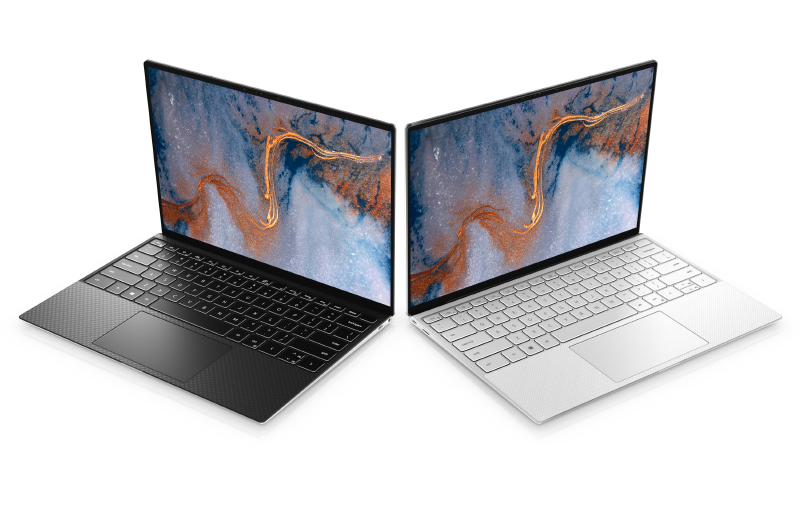

# Dell XPS 9300 (Ice Lake) Hackintosh

### Computer Specs:

| Component        | Name                              |
| ---------------- | ---------------------------------- |
| CPU              | Intel i7 1065G7    |
| iGPU             | Intel® Iris Plus Graphics 1536 MB         |
| Lan              | Unknown                       |
| Audio            | Unknown                     |
| Ram              | 16 GB 3733 MHz LPDDR4X                |
| Wifi + Bluetooth | Unknown             |
| NVMe             | Kingston NV1 500GB M.2 NVMe (the original SK Hynix NVME does not boot in MacOS)     |
| SmBios           | MacBookPro 13                    |
| BootLoader       | OpenCore 0.7.9                     |
| macOS            | Monterey 12.2.1                      |

### What works and What doesn't or WIP:

- [ ] Intel Iris Plus iGPU HDMI Output (Not supported at the moment)
- [ ] Intel Iris Plus iGPU Type-C to HDMI Output (Not supported at the moment)
- [x] Intel Iris Plus iGPU - H264 & HEVC
- [x] Internal Speakers
- [x] Internal microphone
- [ ]  Combojack headphones
- [ ] Combojack microphone
- [ ] HDMI Audio Output (Not supported at the moment)
- [ ] TYPE-C to HDMI Audio Output (Not supported at the moment)
- [x] All USB-A 3.1 Ports (TYPE-C 3.2 Included)
- [x] SpeedStep / Sleep / Wake
- [x] HID Key PWRB & SLPB 
- [x] I2C Touchpad with gesture
- [x] Keyboard (PS2-Internal) with backlight
- [x] F6 & F7 Brightness Key
- [x] F10 Print Screen Key
- [x] F1 & F2 & F3 Sound Key
- [x] Wi-Fi and Bluetooth
- [x] Realtek LAN
- [x] SSD NVME PciE Gen3x4
- [x] Micro SD Cardreader (Internal)
- [x] WebCam (Internal)
- [x] All Sensors CPU, IGPU, BATTERY, NVME, FAN
- [x] ACPI Battery
- [x] NVRAM (Native)
- [x] Recovery (macOS) boot from OpenCore
- [x] Windows 11 boot from OpenCore (not tested but should work)

### Special Config:

- USB port mapping performed
- SSDT-Hack Essential patch

### MacOS bootable USB creation:
- Read the Dortania guide for creating your USB from Windows or macOS
- [Guide Dortania](https://dortania.github.io/OpenCore-Install-Guide/installer-guide/) - USB creation

## Bios settings for Bios Version 1.10.0
### Enable :
* SATA Operation : AHCI
* Fastboot : Thorough
* Integrated NIC : Enable

### Disable : 
* Secure Boot
* Intel SGX
* SMM Security Migration
* Wake on AC
* Wake on Dell USB-C Dock
* Power On Lid Open
* Enable UEFI Network Stack
* Sign Of Life : Early Logo Display / Early keyboard backlight
* cfg lock and DVMT: DO AT YOUR OWN RISK!!! It may brick your laptop. But this is the most important step for power management. Without it, the laptop might idle at 70-100 degrees celsius.

## (IMPORTANT) Fixing iMessage and other services with OpenCore
You'll need to generate your own of the following for MacOS to work correctly (WON'T WORK CORRETCLY WITHOUT IT):

Make sure to generate the strings to the MacBookPro16,2 model.

* MLB
* ROM*
* SystemProductName
* SystemSerialNumber
*SystemUUID

[Link to Guide](https://dortania.github.io/OpenCore-Post-Install/universal/iservices.html#using-gensmbios)

This should be done in macOS or linux.

[CFG UNLOCK](CFG%20LOCK.zip)

1. Copy contents of ZIP above to Downloads folder (~/Downloads/HERE).
2. Run cfglock.sh as sudo.
3. Make sure the values are correct.
4. Edit the script, uncomment putvar and run as sudo again.

- [Apple](https://apple.com) for macOS.
- [Acidanthera](https://github.com/acidanthera) for OpenCore.
- [Dortania](https://dortania.github.io/OpenCore-Install-Guide/config-laptop.plist/icelake.html) For great and detailed guides.
- [Lorys89](https://github.com/Lorys89) For making most of the EFI and configs, and most of the layout of this repo.
